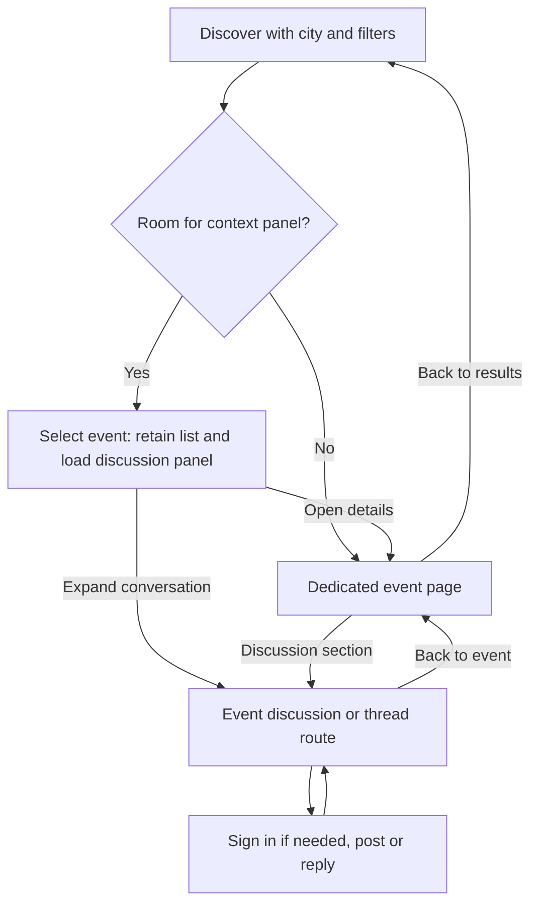

# Product design and responsive UI guidelines

Status: Direction confirmed 2026-10-03. The responsive discovery shell and basic
event details are implemented; account/community participation remains planned.
The [discovery guide](discovery.md) records the exact shipped music-only scope.
These guidelines own UX and information architecture; [product context](../PRODUCT.md)
owns purpose, [delivery](goals/delivery.md) owns scope/status, and the
[API](design/radar-api.md) and [database](design/database.md) plans own technical
contracts. [DESIGN.md](../DESIGN.md) records the implemented visual tokens and
component system; this document retains the broader UX destination.

## Implemented UI subset

The current refactor uses the existing read-only backend: image-led discovery,
sidebar/rail/bottom navigation, disclosed search filters, selected-event previews,
dedicated event pages and section URLs, and contextual return navigation. Preview
failures are isolated from results; event information remains backed by the shared
Ticketmaster service. Planned destinations and participation controls communicate
their unavailable state explicitly. They do not establish completion of saves,
accounts, interest, recommendations, or discussions.

## Direction and principles

Events connect local exploration with useful community knowledge. Borrow local
context and browsability from Yelp/Google Maps, thread organization from
Slack/Teams, and recommendations/shared interests from Reddit/Meetup. Preserve
Ticketopia's friendly, practical identity and accurate source information.
Discovery should work for someone who never posts; community should help them
decide, prepare, and share an experience.

1. **Discovery first, community throughout:** event results lead; relevant social
   information enriches them rather than creating a competing general feed.
2. **Contextual discussions:** event title, date, location, and a route back remain
   identifiable throughout a conversation.
3. **Progressive disclosure:** essential information first, secondary details and
   actions within a clearly labeled next step.
4. **Consistent navigation:** predictable destinations, URLs, Back behavior, and
   selected-event identity across layouts.
5. **Low friction:** saving, expressing interest, recommending, and replying have
   clear feedback and do not require navigating through account screens.
6. **Responsive by design:** desktop, tablet, and phone support the same essential
   tasks with different compositions.
7. **Community without unnecessary complexity:** asynchronous posts, bounded
   threads, and positive reactions precede messaging or complex community tools.

The UI should read as an event discovery product, not a ticket checkout funnel,
workplace messenger, or generic social feed. Avoid presence dots, typing
indicators, unread-pressure badges, and invented engagement counts. Use actual
event imagery, clear date/location hierarchy, readable text, and restrained
separators. Color communicates selection, action, and status with accompanying
text/icons; final palette/type tokens should be validated in later mockups.

## Information architecture and navigation

Use **Discover** consistently as the primary destination (Explore is a synonym,
not a second destination). Proposed web routes below are planning contracts, not
currently available routes; `/` remains discovery's canonical entry.

| Destination | Purpose and proposed route | Navigation placement |
| --- | --- | --- |
| Discover | Nearby/upcoming events, category, date, search, sort; `/` | First item on every layout |
| Saved | Owner-only collection; `/saved` | Primary destination |
| Community | Local/category recommendations and active event conversations; `/community` | Primary destination |
| Interests | Category preferences; `/me/interests` | Desktop navigation; mobile Profile and filter shortcuts |
| Profile | Own profile/privacy/account; `/me`; public view `/users/{user_id}` | Desktop account area; mobile Profile destination |
| Event | `/events/{event_id}` with Overview, Discussion, Community sections | Contextual destination, not a global nav item |
| Thread | `/events/{event_id}/discussions/{discussion_id}` | Shareable direct link with event backlink |

Desktop: labeled global navigation on the left; profile/account at its foot.
Mobile: persistent **Discover / Saved / Community / Profile** bottom navigation;
a compact location header, search field, and account menu when relevant. Interests
and account settings remain reachable from Profile without deep nesting. Tablet:
collapse navigation to a labeled menu or accessible rail before narrowing content.
Guests can read discovery, profiles allowed by privacy, recommendations, and
discussions. A write action offers sign-in and returns to the same event/action;
never imply an action succeeded before authentication and persistence succeed.

MVP community spaces are browsable city/category scopes over events, endorsements,
and discussions, not separately administered groups. No membership system is
needed to read or contribute to an event. Recommendations are explicit human
endorsements, not a personalized activity feed. Broader spaces and membership
management remain future work.

## Layout model and content-driven transitions

**Wide:** three columns when they fit: approximately 12–15rem navigation,
at least 32rem primary content, and 20–24rem contextual discussion, plus gutters
and page padding. Keep the main task dominant. With no selection, the contextual
area may offer relevant local conversations or an unobtrusive selection prompt;
it need not be filled. Dedicated forms/profile settings can use fewer columns.

**Intermediate:** two columns when a readable main column and a roughly 20rem
context panel fit after collapsing navigation. Otherwise use a single column
with a dedicated discussion view. Never force an overlay over the primary task
just because a device is called a tablet.

**Compact:** one column; event selection opens its dedicated page. Do not
compress the desktop rail, list, and discussion into narrow adjacent regions.

Provisional prototype thresholds are about **72rem** for full three-column and
**56rem** for content-plus-context; these derive from the minimum content widths
above, not device labels. Validate and adjust with long titles, localization,
200% text size, browser zoom, and real controls. The rule is to change composition
before content becomes cramped; threshold numbers are not final CSS tokens.
Use a centered readable shell on ultrawide screens rather than stretching prose.

The current discovery implementation uses **72rem** for the full sidebar and
**62rem** for the compact rail plus list/context. The intermediate threshold was
raised to account for the rail while retaining readable primary content. Below
62rem, selection uses the dedicated event view and four-destination bottom nav.

### Responsive behavior matrix

| Element / page | Wide desktop | Intermediate / tablet | Compact / mobile |
| --- | --- | --- | --- |
| Global navigation | Persistent labeled left sidebar | Collapsible menu/rail | Persistent four-destination bottom nav |
| Location/search | Visible above discovery results | Compact header, full search access | Compact header plus labeled search field |
| Filters/sort | Inline primary filters, More filters | Wrap primary filters; secondary disclosure | Scrollable chips, visible Filters and Sort controls |
| Discovery | Main event list + contextual panel | List + panel if both fit; otherwise event route | Vertical single-column cards; event route on selection |
| Event details | Overview center, discussion right; expandable conversation | Overview + discussion when readable; otherwise sections | Dedicated page with Overview / Discussion / Community links |
| Full discussion/thread | Main conversation; event summary in context | Main conversation with optional summary rail | Dedicated feed/thread, compact event header and Back |
| Event actions | Save and Interested visible; Discuss contextual, Recommend secondary | Same semantics with wrapping | Save/Interested visible; Discuss section link; Recommend in labeled More menu |
| Saved events | Owner collection; optional event preview | Collection plus preview only if it fits | Same cards and unsave controls in one column |
| Profile/interests | Profile content; optional public activity context | Single main profile, optional secondary context | Stacked profile, activity sections, interests/privacy access |
| Community | Scoped recommendations/conversations, optional event context | Scope controls + results, optional preview | Same scoped list; event and thread links open dedicated views |
| Secondary actions | Anchored menu or inline disclosure | Menu or simple sheet | One menu/sheet at a time; long tasks get a page |
| Pagination | Explicit Load more plus normal links | Same | Tap-friendly Load more, no mandatory infinite scrolling |
| Composer | In event panel or full discussion | Panel if usable, else discussion page | Easily reached Write/Reply; keyboard-safe composer |

Default to normal document scrolling. An independently scrolling desktop panel
is acceptable only with an obvious boundary, keyboard access, and preserved
position; avoid three independently scrolling columns.

## Major screen structures

Wireframes show intended hierarchy, not final dimensions or visual styling.
All counts and content below are illustrative.

### 1. Desktop discovery

```text
+---------------+--------------------------------+--------------------------+
| Ticketopia    | Los Angeles [Change] [Search]  | Selected event           |
| Discover     | Category / Date / Filters Sort | Title · date · venue     |
| Saved        | Nearby events                  | [Open event details]     |
| Community    | [Image] Title · date · venue   | Discussion (24 threads)  |
| Interests    | 86 interested · 24 discussions | Question ... [Replies]   |
|              | [Save] [Interested] [Discuss]  | Tip ...                  |
| Profile      | More event cards ...           | [Write a post]           |
| Account      | [Load more]                    | [Expand discussion]      |
+---------------+--------------------------------+--------------------------+
```

Cards show title, image, local date/time (or explicit TBA), venue/city, event
status, and a compact community summary. Known prices may appear below; unknown
prices never mean free. Keep selection separate from nested action buttons.
The event title is a real detail link. Enhanced selection/Discuss loads that
event's panel without replacing results; Save/Interested never also select it.

### 2. Desktop event details and expanded discussion

```text
+------------+----------------------------------+---------------------------+
| Global nav | Back to results                  | Event discussion          |
|            | Event image / Title              | Root posts + reply counts |
|            | Date · venue · city · status     | [Open thread]             |
|            | [Save] [Interested] [More]        | [Write a post]            |
|            | Overview / Discussion / Community| [Expand discussion]       |
|            | Description / prices / ticket link|                          |
+------------+----------------------------------+---------------------------+
```

The event header and critical details lead. External ticket links name the
provider and do not imply ticket ownership or guaranteed availability. Expanded
Discussion promotes the conversation to the center and puts a concise event
summary in context; it must not duplicate two live composers for the same thread.
Community shows endorsements and permitted public participants, with a clear
Recommend action. Full descriptions, venue information, and source freshness
remain accessible through Overview.

### 3. Mobile discovery

```text
+----------------------------------+
| Los Angeles [Change]    [Account] |
| Search events                    |
| Nearby  Upcoming  Recommended -> |
| [Category] [Date] [Filters] [Sort]|
| [Event image]                    |
| Event title                      |
| Sat · venue · city               |
| 86 interested · 24 discussions    |
| [Save] [Interested]    [Discuss]  |
| Next card ...       [Load more]  |
| Discover | Saved | Community | Me|
+----------------------------------+
```

Cards form a vertical list, not a carousel. Horizontal filter chips show a
visible overflow cue, remain keyboard-reachable, and have a full Filters
alternative. Nearby is city-based in the MVP; retain editable IP/remembered-city
defaults and manual fallback. Upcoming uses dates; Recommended uses explicit
community endorsements with clear ordering. Saved has its own persistent nav
destination. Map/list switching is optional later, only if it improves a verified
discovery task; do not require maps or precise geolocation for MVP parity.

### 4. Mobile event details

```text
+----------------------------------+
| Back to results                  |
| Event image / Title              |
| Date · time · venue · city        |
| Status / known price             |
| [Save] [Interested] [More]        |
| Overview | Discussion | Community|
| Selected section content         |
| Ticketmaster ticket link         |
| Discover | Saved | Community | Me|
+----------------------------------+
```

Selecting a card opens Overview; selecting Discuss opens Discussion directly.
Section links carry URL state and work on reload/direct entry. Prefer navigable
section links; use ARIA tab semantics only if implementing the full tab keyboard
pattern. Save/Interested are available without opening a menu; Recommend appears
in More and the Community section. Secondary metadata follows the event's
identity, date, place, status, and actions. Do not let a tall hero push all useful
information below the first screen.

### 5. Mobile discussion and threaded replies

```text
+----------------------------------+
| Back to event · Event title       |
| Sat · venue · Discussion          |
| [Write a post]                    |
| Author · time                    |
| Question or tip ...              |
| [Helpful 3] [4 replies] [More]     |
| More root posts ... [Load more]   |
| Discover | Saved | Community | Me|
+----------------------------------+
             open thread
+----------------------------------+
| Back to discussion · Event title  |
| Root question                    |
| Reply · author · time            |
| Replying to @name: reply ...      |
| [Helpful] [Reply] [More]          |
| [Load earlier/more replies]       |
| [Reply text ...] [Post reply]     |
+----------------------------------+
```

A discussion is a root post plus its replies; the event discussion feed lists
root posts. Display root posts newest-first initially and replies oldest-first
with stable ordering. Limit visual nesting to one level; replies to replies
retain an explicit target and stay in the root thread rather than indenting
indefinitely. A shareable thread route handles long conversations; short previews
may expand inline. Removed posts retain a content-free placeholder for context.

Use sheets for short actions (report reason, action menu), not an entire nested
conversation. Close/replace a sheet before opening another. Write/Reply remains
easy to reach; a sticky composer must fit above the keyboard/safe area and avoid
overlapping bottom navigation. While typing, navigation can leave the keyboard
viewport but returns on dismissal. Preserve drafts on validation/network failure
and warn before deliberately discarding them. Replies are asynchronous: explicit
refresh or a non-disruptive new-content notice suffices; no live-chat dependency.

### 6. Profiles, interests, and saved events

Own profile: display name/avatar, interests, privacy settings, and clearly
separated public-profile preview and private account controls. Public profiles
show public recommendations, contributions, and only opted-in Interested events.
They never show saved events or infer them from activity. Category preferences
are private by default; choosing them does not mark any particular event Interested.
On mobile, stack profile sections and offer direct links to interests/privacy.

Saved: private collection with the same event cards, date/status filters, and
clear unsave/undo feedback. Saving a past or cancelled event preserves its identity
with its status; it does not silently disappear. Desktop/tablet can preview a
selected event if space permits; mobile opens its page. Empty collection: explain
Save and link to Discover. Signed-out Saved explains sign-in and restores the
destination afterward. Privacy settings should explain that hiding interest does
not hide separately published posts or endorsements.

### 7. Community discovery and participation

Start with chosen city and optional category. Show two clearly named collections:
**Recommended events** (endorser and optional reason) and **Event conversations**
(event identity, root-post excerpt, reply count). Default to recent endorsements
and recently active threads with deterministic ordering; do not pretend these are
personalized matches. A recommendation opens the event; a conversation opens the
thread. Both support pagination and empty states that invite a useful contribution
without pressuring users to post. The same scopes and contributions work on mobile.

Participation uses the event's existing discussion and recommendation controls,
not a duplicate community-specific thread. Basic reporting and owner moderation
follow the [community goals](goals/event-communities.md#moderation-starting-small).
Large-scale group creation, roles, private groups, and community administration
are later milestones.

## Interaction semantics and hierarchy

| Interaction | Meaning and visibility | Current-user feedback | Aggregate information |
| --- | --- | --- | --- |
| Save / Bookmark | Private personal collection; not an attendance signal | Save / Saved, reversible; owner-only | No public save counts or saver lists |
| Interested | Interest, not confirmed attendance or ticket ownership; private profile visibility by default with explicit public opt-in | Interested toggle with separate visibility control | Total interest count may include private identities; participant lists show only opted-in people |
| Recommend | Explicit public event endorsement, independent of interest; optional short reason | Recommend / Recommended; edit reason or withdraw | Recommendation count and attributable public endorsements |
| Discuss | Public root posts, replies, questions, and practical advice about this event | Write, Reply, edit/remove own contribution | Discussion count means visible root threads, not total messages |
| Helpful | Positive reaction to an individual post/reply, never an event vote | Helpful pressed/unpressed state | Post-level count only; no downvote score |

Aggregate interest counts convey totals, not identity anonymity guarantees for
small groups. Never expose private identities via public lists, API fields,
activity feeds, or count drill-downs. A count and a current-user pressed state
are separate data: “86 interested” does not mean “You are interested.” Unknown
or failed counts are unavailable, never fabricated zeroes. Recommendation counts,
discussion counts, and Helpful counts retain distinct labels everywhere.

**Card hierarchy:** title/date/location first, community summary next; compact
Save and Interested controls, with Discuss as a contextual link. Recommend is a
secondary More-menu action. **Event page:** same toggles, prominent discussion
entry, endorsement in Community/More, clearly separated external ticket link.
**Conversation:** Reply is the primary task, Helpful secondary, edit/report in
More. Do not render four equally dominant event buttons or merge them into Like.
Recommendation submission discloses public attribution before committing; it
does not automatically save, mark interest, or publish a discussion post.

## Discovery-to-discussion journeys and shared state



- Encode discovery filters and selected event in the URL (proposed
  `selected_event` query parameter). Event/section/thread URLs use the same stable
  event ID. Keep a return context for results; direct entry without it uses a
  clear Discover link rather than a broken Back control.
- An explicit event selection creates navigable history. Back restores previous
  selection/results, loaded pages where available, scroll, and focus. Refresh or
  shared links can reconstruct the same event; no selection exists only in DOM
  classes. Filter changes reset pagination and clear an out-of-scope selection.
- When resizing, preserve event/section/thread identity and drafts: a panel
  becomes an in-shell dedicated view, not lost functionality or a new selection.
  Do not create history entries just because the viewport changes.
- Load only the selected event's first discussion page, using cached metadata
  immediately. Cancel obsolete loads or reject responses whose event ID/request
  generation no longer matches selection. Never show event A's posts under B.
- Keep loading/error feedback local to the panel. Failure offers Retry and Open
  event; discovery remains usable. Anonymous/public metadata can be cached;
  owner states and permission-filtered fields must not leak through shared cache.
- With enhancement unavailable, detail/thread links and forms navigate normally.
  Preserve the current no-JavaScript search/pagination baseline; server-rendered
  routes remain the fallback for contextual interactions.

## Reusable UI and technical boundaries

Use the existing Go/Echo, templ, htmx, Tailwind stack. Organize reusable templ
components by responsibility, not separate desktop/mobile implementations:

| Component family | Shared responsibility |
| --- | --- |
| Application shell | Global/bottom navigation, location header, main/context slots, return links |
| Discovery controls | Search, category/date filters, sorting, selected chips, pagination |
| Event presentation | EventCard, EventHeader, date/venue/status, responsive image, source/freshness |
| Event interactions | SaveToggle, InterestToggle, Recommend action/form, CommunitySummary |
| Discussions | DiscussionList, Post, Thread, ReplyTarget, Composer, HelpfulToggle |
| Identity/privacy | ProfileSummary, public-profile preview, interest visibility, authentication return |
| Feedback/overlays | Loading, empty/error states, status announcement, action menu, single sheet/dialog |

Names are conceptual, not prescribed files. Components receive normalized view
models from shared services; provider payloads and database rows do not become
template contracts. Separate event aggregates from viewer-specific action state.
Use one active composer/selection owner per view. Mutations update both the
selected card and panel from the server's authoritative state, with visible
pending/failure feedback; optimistic toggles must roll back on failure. Preserve
idempotent action semantics and avoid whole-list reloads for one action. See the
[API plan](design/radar-api.md#contextual-loading-and-client-state) for fetching.

## Accessibility, mobile usability, and resilient states

- Target WCAG 2.2 AA. Use semantic landmarks/headings, a skip link, labeled nav
  regions and fields, visible focus, and correct current/pressed states. Keep DOM
  reading order meaningful when columns collapse. No hover-only controls.
- Aim for at least 44×44 CSS-pixel touch targets, including icon hit areas, with
  spacing between destructive and ordinary actions. All actions work with a
  keyboard. Menus/dialogs manage Escape, focus entry, and return; section links
  remain ordinary navigable links unless full tab semantics are implemented.
- Start body/input text around 1rem with comfortable line height (roughly 1.5);
  allow wrapping, text resizing, and long unbroken input without page overflow.
  Maintain AA contrast (4.5:1 normal text, 3:1 large text and essential UI cues).
  Aim for 45–75 characters per line in conversations; metadata must remain legible.
- Account for safe-area insets and browser/virtual-keyboard viewport changes.
  Reserve space for bottom nav/sticky actions so the last post and focused field
  are never covered. Avoid nested sheets and horizontal page scrolling at 320px.
- Reserve image aspect ratios to avoid shifts; choose suitable source sizes,
  lazy-load offscreen imagery, and retain text fallbacks when images fail. Use
  useful alt text or empty alt for imagery redundant with adjacent event text.
- Announce panel changes/loading completion succinctly, not every count update.
  Keep focus on a selection control; offer a clear Jump to discussion link. Full
  route navigation moves focus to the page heading; closing context restores it
  to the triggering event. Honor reduced motion and avoid animated list jumps.
- **Loading:** scoped skeleton/status with stable layout; don't blank usable
  results. Prevent duplicate writes while pending. Pagination keeps earlier data.
- **Empty:** distinguish no matching events, no saved events, and no posts yet;
  offer clear filters, Discover, or Write a post as appropriate.
- **Error:** local retry, readable field errors, preserved filters/drafts, and
  truthful mutation state. Expired sessions return through sign-in to context.
  Community failure does not suppress available event metadata, or vice versa.
- **Unavailable/stale:** show source freshness and cancellation/postponement;
  preserve local discussions when upstream data disappears, labeling unavailable
  event details. Removed/moderated content preserves reply structure but not text.

## Validation and remaining design work

Before calling the redesigned UI delivered, verify the same journey on wide,
intermediate, and compact layouts: discover, save, mark interest, recommend,
open a conversation, reply, react, and return to results. Include direct thread
links, rapid selection changes, Back/reload, resize, authentication return, privacy
checks as another user, long content, empty/stale/error cases, keyboard-only use,
screen-reader landmarks, 320px reflow, and zoom. The existing discovery tests do
not establish parity for these unimplemented screens.

The implemented discovery subset has been checked at desktop/tablet and 320/390px
widths, including URL state, error recovery, no-JavaScript fallback, keyboard focus,
200% text, and automated accessibility checks. Full community journeys and composer
behavior with the keyboard visible remain future verification. No map provider,
real-time infrastructure, new frontend framework, or
personalization engine is required by this direction. MVP and retained future
goals are explicitly separated in the [delivery checklist](goals/delivery.md#mvp-release-boundary).
